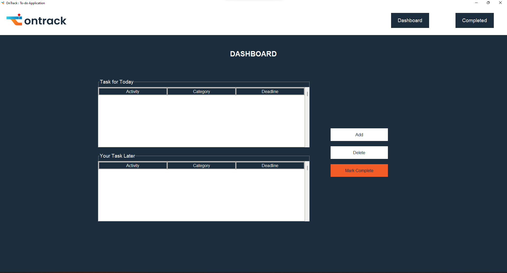

# Tugas 7 Implementasi IF3152 Rekayasa Perangkat Lunak STI
## Kelompok 11 - OnTrack (TodoList Application)
+ Kofifan Hertza H 18220022
+ Faris Tristan Fabian 18220042
+ Ammar Raihan 18220044
+ Muhammad Ammar M 18220072
+ Sitanggang Jerry Josia P 18220082

## Penjelasan Aplikasi
Aplikasi ini bernama OnTrack, yaitu aplikasi yang ditujukan untuk melakukan pencatatan to do list.

Terdapat 5 fitur yang diimplementasikan, namun secara garis besar terdapat 3 modul utama yaitu modul controller dengan nama file manageAcitvity.py untuk me-manage aktivitas yang berisikan fitur add aktivitas, delete aktivitas, mark as complete aktivitas. Modul berikutnya adalah modul entity dengan nama file databaseManager.py untuk me-manage aktivitas dalam database. Modul terakhir adalah modul boundary dengan nama file userInterface.py yang berisikan dashboard yang menampilkan daftar aktivitas hari ini dan yang akan datang dan completed page yang menampilkan daftar aktivitas yang telah selesai.

## Cara menjalankan aplikasi

## Daftar Modul yang diimplementasi
1. Add Activity

    NIM Penanggung Jawab : 18220022
    Nama Penaggung Jawab : Kofifan Hertza H

2. Delete Activity

    NIM Penanggung Jawab : 18220042
    Nama Penaggung Jawab : Faris Tristan Fabian

3. Mark as Complete

    NIM Penanggung Jawab : 18220072
    Nama Penaggung Jawab : Muhammad Ammar M

4. Complete Page

    NIM Penanggung Jawab : 18220082
    Nama Penaggung Jawab : Sitanggang Jerry Josia P

    Screen Capture:

    

5. Dashboard

    NIM Penanggung Jawab : 18220044
    Nama Penaggung Jawab : Ammar Raihan

    Screen Capture:

    
    

## Daftar Tabel Basis Data yang Diimplementasi
1. List_of_Activities:

    ActivityID INT
    ActivityName VARCHAR(255)
    Deadline DATE
    CategoryName VARCHAR(255)
    isDone TINYINT(1)

2. List_of_Categories:

    CategoryID INT 
    CategoryName VARCHAR(255)
